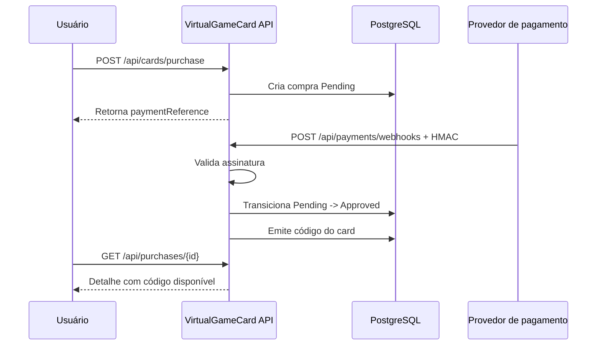

<div align="center">

# 🎮 VirtualGameCard API

**Backend seguro para compra, pagamento e entrega de gift cards digitais.**

Uma API em **.NET + PostgreSQL** com autenticação JWT, refresh token rotativo,
compra idempotente, webhook de pagamento assinado e histórico isolado por usuário.

<p>
  
  
  
  
  
</p>

[API online](https://virtualgamecard.onrender.com/healthz) ·
[Frontend online](https://lbss9.github.io/VirtualGameCardFrontend/) ·
[Frontend repo](https://github.com/lbss9/VirtualGameCardFrontend)

</div>

---

## ✨ Sobre

O **VirtualGameCard** é o backend de uma plataforma de compra de créditos digitais para jogos.
O usuário escolhe uma plataforma, seleciona um valor entre **R$ 5 e R$ 250**, inicia o pagamento
e recebe o código do card somente após confirmação segura do provedor.

O projeto foi construído com foco em:

- segurança de autenticação e sessão;
- regras de negócio isoladas da camada HTTP;
- respostas padronizadas para o frontend;
- transações em operações compostas;
- testes de integração, concorrência e validação;
- deploy gratuito usando Render + Neon.

## 🧭 Arquitetura

```text
VirtualGameCard.Domain
├─ Entidades
├─ Enums
└─ Contratos de repositório

VirtualGameCard.Application
├─ Auth
├─ Profile
├─ Purchases
├─ Notifications
├─ Support
├─ Commands / Queries / Handlers
└─ Validators e Results

VirtualGameCard.Infrastructure
├─ EF Core + PostgreSQL
├─ Repositórios
├─ JWT
├─ HMAC de webhooks
└─ Unit of Work

VirtualGameCard.Api
├─ Controllers
├─ CORS
├─ Rate limiting
├─ Auth JWT
├─ Exception handling
└─ OpenAPI

VirtualGameCard.Tests
├─ Testes HTTP
├─ Testes transacionais
├─ Testes de concorrência
└─ Testes de contrato
```

## 🔐 Segurança

- Senhas com **BCrypt**.
- Access token JWT curto.
- Refresh token rotativo em cookie `HttpOnly`.
- Detecção de reutilização de refresh token.
- Logout com revogação real da sessão.
- Tokens sensíveis persistidos como hash.
- Rate limiting em rotas sensíveis.
- Compra protegida por usuário autenticado e e-mail verificado.
- Webhook de pagamento com assinatura **HMAC-SHA256**.
- Código do card não aparece na listagem, apenas no detalhe autorizado.
- Respostas de erro sem stack trace ou detalhes internos.

## 🧾 Contrato de resposta

Todas as respostas JSON seguem o mesmo envelope:

```json
{
  "message": "Operação concluída.",
  "code": "STABLE_CODE",
  "path": "/api/resource",
  "statusCode": 200,
  "data": {}
}
```

Isso deixa o frontend mais previsível para lidar com sucesso, erro, validação e autenticação.

## 🚀 Funcionalidades

### Autenticação

- Cadastro
- Login
- Refresh token
- Logout
- Recuperação de senha
- Redefinição de senha
- Verificação de e-mail

### Perfil

- Dados do usuário autenticado
- Solicitação de confirmação de e-mail
- Alteração de senha
- Encerramento das sessões após troca de senha

### Compras

- Compra idempotente via `Idempotency-Key`
- Valores de R$ 5 a R$ 250, em intervalos de R$ 5
- Plataformas como Steam, Xbox, PlayStation, Nintendo, Google Play e Roblox
- Pagamento pendente até webhook aprovado
- Código emitido somente após pagamento aprovado
- Histórico paginado
- Detalhe isolado por usuário

### Notificações e suporte

- Central de notificações
- Marcar uma notificação como lida
- Marcar todas como lidas
- Abertura de chamados de suporte

## 🧪 Qualidade

O projeto possui testes cobrindo:

- cadastro, login, refresh e logout;
- reutilização de refresh token;
- reset de senha expirado/reutilizado;
- isolamento entre usuários;
- compra idempotente;
- validações de comandos;
- rollback transacional;
- concorrência;
- webhook idempotente;
- OpenAPI e contrato das rotas.

Comandos úteis:

```powershell
dotnet test VirtualGameCard.slnx
dotnet format VirtualGameCard.slnx --verify-no-changes
dotnet list VirtualGameCard.slnx package --vulnerable --include-transitive
dotnet ef migrations has-pending-model-changes `
  --project VirtualGameCard.Infrastructure `
  --startup-project VirtualGameCard.Api
```

## ⚙️ Rodando localmente

### Requisitos

- .NET 10 SDK
- PostgreSQL
- EF Core CLI

### Banco local

Se estiver usando Docker Compose do projeto:

```powershell
docker compose up -d db
```

### API

```powershell
dotnet run --project VirtualGameCard.Api --urls http://localhost:8090
```

Health check:

```text
http://localhost:8090/healthz
```

OpenAPI:

```text
http://localhost:8090/openapi/v1.json
```

## 📊 Observabilidade: Prometheus + Grafana

O projeto já possui observabilidade local completa:

- métricas HTTP automáticas da API;
- endpoint Prometheus em `/metrics`;
- métricas de negócio para autenticação, compras, webhooks e suporte;
- Prometheus provisionado;
- Grafana provisionado com datasource e dashboard.

Suba a stack completa:

```powershell
docker compose up -d --build
```

Serviços:

| Serviço | URL |
|---|---|
| API | `http://localhost:8080` |
| Health check | `http://localhost:8080/healthz` |
| Métricas | `http://localhost:8080/metrics` |
| Prometheus | `http://localhost:9090` |
| Grafana | `http://localhost:3000` |

Login local do Grafana:

```text
usuário: admin
senha: admin
```

Dashboard provisionado:

```text
VirtualGameCard / VirtualGameCard · Observability
```

Principais métricas customizadas:

| Métrica | Descrição |
|---|---|
| `vgc_auth_events_total` | Login/cadastro por resultado |
| `vgc_purchase_events_total` | Eventos de compra por plataforma, método, status e origem |
| `vgc_payment_webhook_events_total` | Webhooks de pagamento por status e resultado |
| `vgc_support_tickets_total` | Chamados por categoria e resultado |
| `vgc_app_info` | Identificação da aplicação/ambiente |

Por segurança, `Metrics:Enabled` é `false` por padrão em produção. No Docker Compose local ele é ativado com:

```env
Metrics__Enabled=true
```

## 🔑 Variáveis de ambiente

Em produção, configure:

| Variável | Descrição |
|---|---|
| `ConnectionStrings__Default` | Connection string PostgreSQL |
| `Jwt__Secret` | Segredo JWT com pelo menos 32 bytes |
| `Jwt__Issuer` | Emissor do token |
| `Jwt__Audience` | Audiência do token |
| `PaymentWebhook__Secret` | Segredo HMAC dos webhooks |
| `Cors__AllowedOrigins__0` | Origem pública do frontend |
| `Metrics__Enabled` | Habilita `/metrics`; use com cuidado em produção |
| `ASPNETCORE_ENVIRONMENT` | `Production` |

Também é aceito `DATABASE_URL` no formato `postgresql://...`, útil em providers como Neon.

## 🌍 Deploy gratuito

Este repositório já inclui:

- [`Dockerfile`](Dockerfile)
- [`render.yaml`](render.yaml)
- suporte à variável `PORT` do Render;
- health check em `/healthz`;
- migrations automáticas na inicialização.

Stack usada no deploy atual:

```text
Frontend  → GitHub Pages
Backend   → Render Free
Database  → Neon PostgreSQL Free
```

> No plano gratuito do Render, o serviço pode dormir após inatividade. O primeiro acesso pode demorar um pouco.

## 💳 Fluxo de pagamento



## 📚 Rotas principais

| Método | Rota | Acesso | Descrição |
|---|---|---|---|
| `POST` | `/api/auth/register` | Público | Criar conta |
| `POST` | `/api/auth/login` | Público | Login |
| `POST` | `/api/auth/refresh` | Cookie | Renovar sessão |
| `POST` | `/api/auth/logout` | Auth | Encerrar sessão |
| `POST` | `/api/auth/forgot-password` | Público | Solicitar reset |
| `POST` | `/api/auth/reset-password` | Público | Redefinir senha |
| `GET` | `/api/me` | Auth | Perfil |
| `POST` | `/api/me/password` | Auth | Alterar senha |
| `POST` | `/api/me/email-verification` | Auth | Enviar confirmação |
| `POST` | `/api/cards/purchase` | Auth | Criar compra |
| `GET` | `/api/purchases` | Auth | Listar compras |
| `GET` | `/api/purchases/{id}` | Auth | Detalhar compra |
| `GET` | `/api/notifications` | Auth | Listar notificações |
| `POST` | `/api/support/tickets` | Auth | Abrir chamado |
| `POST` | `/api/payments/webhooks` | HMAC | Confirmar pagamento |

## 🧑‍💻 Autor

Feito por [Luan Barbosa](https://github.com/lbss9).

## 📜 Licença e uso

Este projeto é **público apenas para fins de portfólio, demonstração e revisão de código**.
Ele **não é open source**.

Nenhuma permissão é concedida para copiar, baixar, clonar, modificar, distribuir, hospedar,
comercializar ou criar trabalhos derivados sem autorização prévia e expressa do autor.

Consulte a licença proprietária em [`LICENSE`](LICENSE).

---

<div align="center">

**VirtualGameCard** — API segura, bonita por dentro, pronta para evoluir. ✦

</div>
